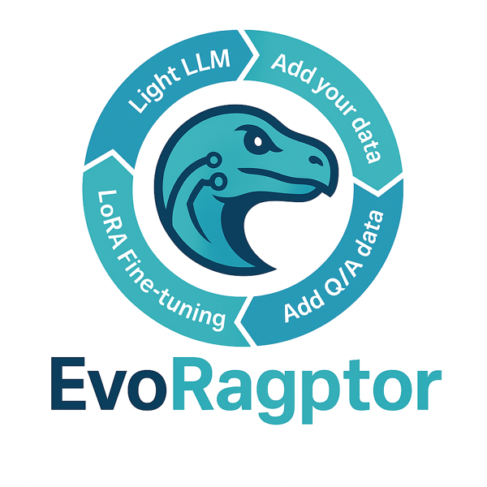

# EvoRagptor — Light LLMs specialized on your business data

> 🦖 Build **lightweight, fast, and focused LLMs** that understand your domain, your documents, and your real-world use cases.

---

## 🎯 Project goal

Provide an **end-to-end solution** to create, evaluate, and deploy **Light LLMs** (small language models) **specialized** for a specific domain by leveraging your **business data** (documents, FAQs, Q/A, internal knowledge bases).
The idea: keep things **lightweight** (low cost, low latency) while delivering **high relevance** thanks to fine adaptation (LoRA) and a data-centric approach.

---

## ✨ Features

* **Data ingestion**: PDF, DOCX, HTML, CSV, Markdown, FAQ/Q\&A bases.
* **Cleaning & chunking**: normalization, language detection, context-optimized splits.
* **Q/A sets**: assisted generation or import of reference Q/A pairs.
* **LoRA adaptation**: lightweight fine-tuning on the chosen open-source *base model* (e.g., `Qwen2.5-0.5B`, `Phi-3-mini`, etc.).
* **Evaluation**: precision/recall metrics, exact match, Rouge/LF, and guided human tests.
* **Deployment**: export to GGUF/ONNX for edge CPU/GPU, FastAPI server ready to run.
* **Observability**: inference traces, dataset tracking, and training run monitoring.

---

## 🧭 Workflow

1. **Light LLM** → choose a small base model suited to your constraints.
2. **Add your data** → import your business documents.
3. **Add Q/A data** → create or import representative question/answer pairs.
4. **LoRA Fine-tuning** → adapt the model quickly and cost-effectively.
5. **Evaluate** → validate quality on a held-out set.
6. **Serve** → export + API server (or integrate into your app).

---
